

    [ about ] [ name ] mustafa  
    [ about ] [ description ] yet another random / ordinary dev ( junior ).  
    [ about ] [ statement ] i do respect powerful programming languages.   
    [ about ] [ belief - opinion ] prefer java's clear - long and verbose over syntax kotlin's expressive and concise syntax.  
    [ about ] [ belief - opinion ] simplicity in itself is a powerful framework so you can use it and take advantage of it.  
    [ about ] [ belief - opinion ] dispite java's long - verbose syntax preference, like ruby's beautiful - short syntax.
    [ about ] [ belief - opinion ] every framework is built upon a certain conviction. choosing a framework isn't a neutral act; it's an ideological act. you are not just picking what's convenient; you're aligning yourself with a set of beliefs about how things should be done.

    

        [ info ] definition of a powerful programming language
    

        [.] there are several elements that may govern the definition of a powerful programming language.  
        [.] a powerful programming language is a language with:
        <ul>
            <li>a massive popularity.</li>
            <li>a massive ecosystem and a massive amount of packages.</li>
        </ul>

    

        [ info ]  powerful programming languages:
    

        
        
        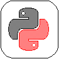
        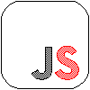

    

       [ admired - respected ] [ language ]
    

        
        
        

    

        [ favorite ] [ text editor - IDE ]
    

        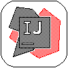
        
        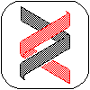

    

       [ favorite ] [ web ]
    

        
        
        
        
        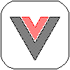
        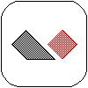
        

    

       [ favorite ] [ language ]
    

        
        
        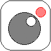
        

    

        [ favorite ] [ framework ]
    

        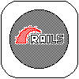
        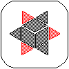

    

        [ favorite ] [ game engine ]
    

        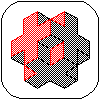
        

    

        [ favorite ] [ operating system ]
    

        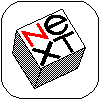
        
        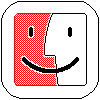

    

       [ favorite ] [ database ]
    

        
        

    

        [ favorite ] [ paas ] 
    

        
        
        
        

